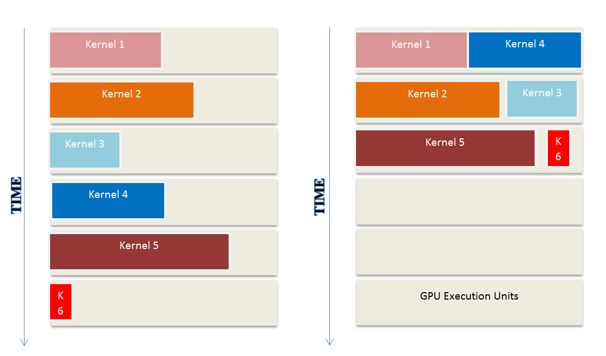
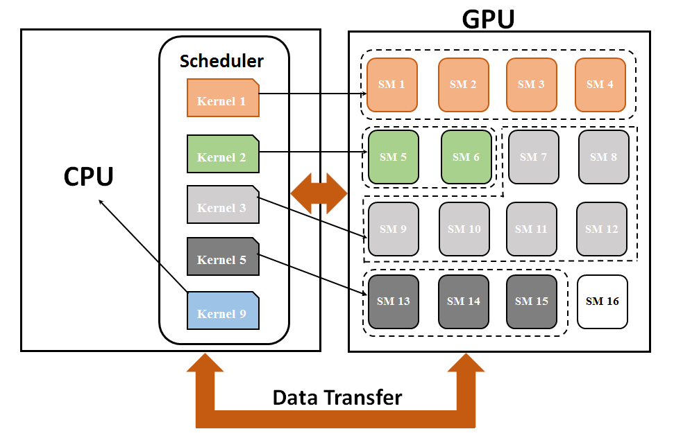
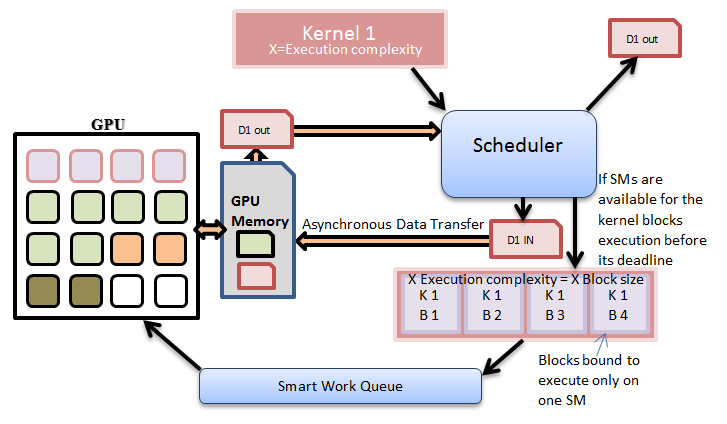

# Dynamic Schedule Management Framework For GPUs

## Soft Real Time GPU Scheduler
A schedule management framework for soft-real-time jobs that may be used by a CPU - GPU system designer/integrator to select, configure and deploy a suitable architectural platform and to perform concurrent scheduling of these jobs.

### Dynamic schedule management framework for aperiodic soft-real-time jobs on GPU based architectures

Graphics Processing Units (GPUs) are computational powerhouses that were originally designed for accelerating graphics applications. However, in recent years, there has been a tremendous increase in support for general purpose computing on GPUs (GPGPU). GPU based architectures provide unprecedented magnitudes of computation at a fraction of the power used by traditional CPU based architectures. As real-time systems integrate more and more functionality, GPU based architectures are very attractive for their deployment. 

However, in a real-time system, predictability and meeting temporal requirements are much more important than raw performance. While some realtime jobs may benefit from the performance that all cores of the GPU can provide, most jobs may require only a subset of cores in order to successfully meet their temporal requirements.  In this work, we implement concurrent scheduling of softreal-time jobs and a-periodic jobs on a GPU based platform, while optimizing the memory usage on the GPGPU.

**The above image depicts our framework. As seen in the figure, our scheduling framework resides on a CPU core and dispatches kernels to the GPU.**

