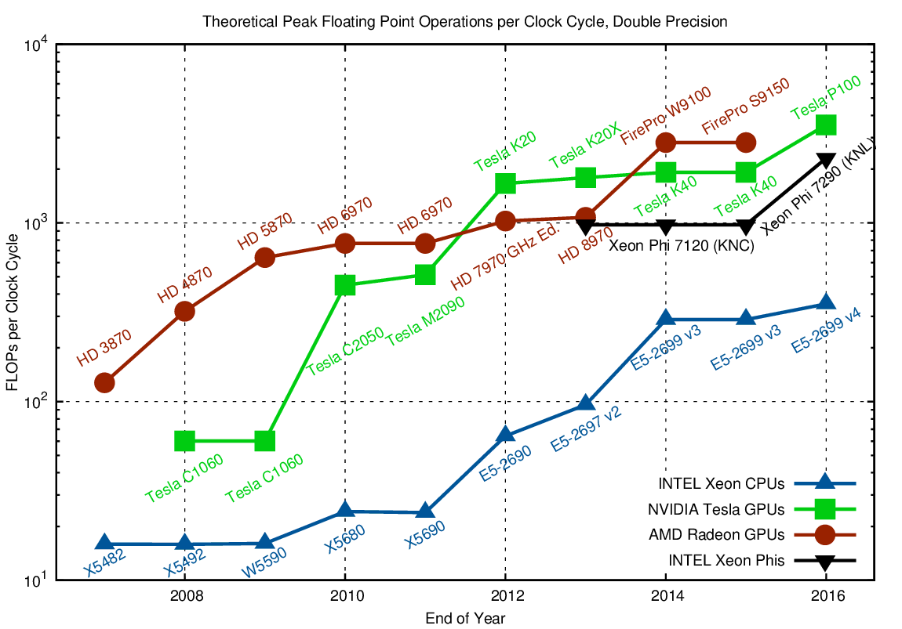
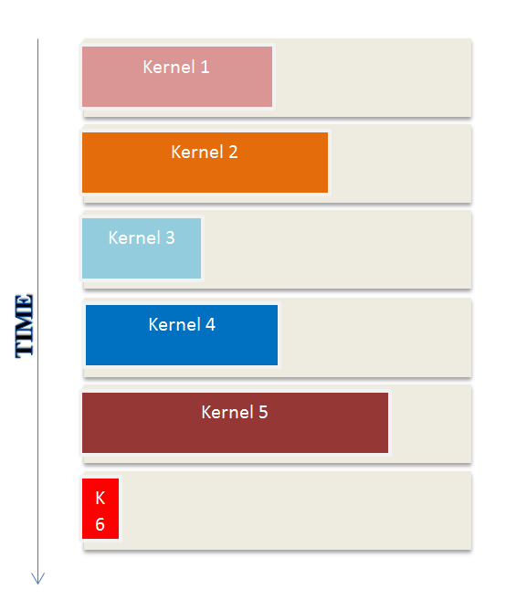
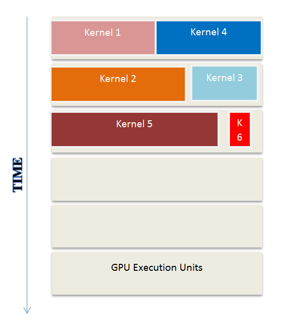
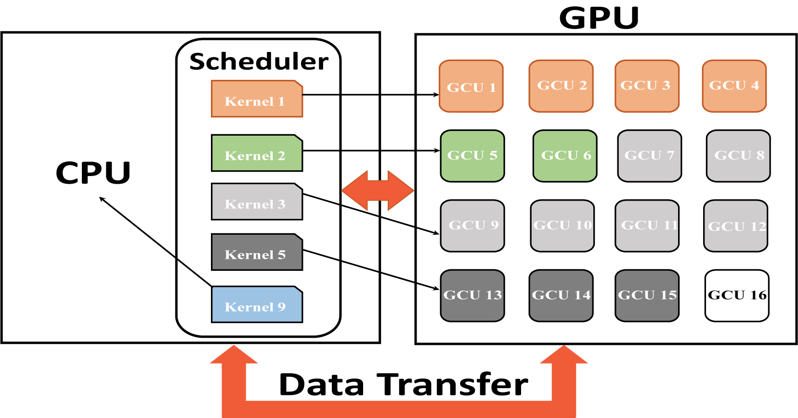

# Dynamic Schedule Management Framework For GPUs

## Soft Real-Time GPU Scheduler

A schedule management framework for soft-real-time jobs that may be used by a CPU - GPU system designer/integrator to select, configure, and deploy a suitable architectural platform and to perform concurrent scheduling of these jobs. 

[Real-Time GPU Scheduler](RTG-scheduler) (RTG-Scheduler) is a dynamic scheduler for aperiodic soft-real-time jobs on GPU based architectures, with a simple, easy-to-use command-line interface (CLI). The SRTG-Scheduler is provided under the [MIT license](https://opensource.org/licenses/MIT). It is currently supported on Windows, Linux, and macOS platforms.

## Dynamic schedule management framework for soft-real-time jobs on GPU based architectures

 

#### [GPUs](scheduler_info.md#graphics-processing-units-in-real-time) execute at higher frequencies 

* Accelerates execution of jobs allocated to it
* Improves System response time

 The above image compares FLOPs per Cycle improvements over the years <a href="#note1" id="note1ref">[1]</a> 

#### [GPUs](scheduler_info.md#graphics-processing-units-in-real-time) are energy efficient

* Power needed for GPU to carry out an operation lesser than CPUs
* Ideal for use in real time embedded system

 

* Significant hardware and firmware challenges
* Executions are non-preemptive 
* Low degree of controllability of cores

* Policies for scheduling Real-Time jobs 
* Decoding the driver
* Managing the GPU as a resource
* Targeting a Multi-GPU model

This entire body of work assumes that only one kernel may execute on a GPU at a given time(partly due to lack of hardware support)

#### What's the problem?

Sending a single non-preemptive kernel on to a GPU, is under utilizing the GPU

#### Solution

Concurrent Kernels Execution on GPU <a href="#note2" id="note2ref">[2]</a>

* Safe concurrent kernels
* Performance boost
* Execution units available

Aims to develop a dynamic schedule management framework for soft-real-time
jobs on GPU based architectures. 

We propose to exploit this basic idea to perform coarse grained scheduling of jobs on GCUs.

Our work lays emphasis on minimal programmer involvement.

A dynamic schedule management framework that is responsible for

* Keeping track of current and expected GUC availability
* Determining which kernel(s) to dispatch to the GPU at a given time
* Determining how many GCUs to assign for a given kernel.

#### Advantages

* GPU provides tremendous computational power under reasonable power/energy budgets
* Our work exploits concurrent kernel execution for real-time scheduling
* More economical than multi-GPU model

#### Results

* Dynamic schedule management [framework](RTG-scheduler#real-time-gpu-scheduler) for soft-real-time jobs
* Support for [a-periodic](RTG-scheduler#real-time-gpu-scheduler) and recurring (periodic) soft-real-time tasks.
* Smart GPU Memory Management

**note:**

* <a id="note1" href="#note1ref">[1]</a> [FLOPs per Cycle for CPUs, GPUs and Xeon Phis](https://www.karlrupp.net/2016/08/flops-per-cycle-for-cpus-gpus-and-xeon-phis/)

* <a id="note2" href="#note2ref">[2]</a> [Concurrent soft-real-time job execution on GPUs - Page 13 & 14](https://people.mpi-sws.org/~bbb/proceedings/rtas14-wip-proceedings.pdf)

