[](https://travis-ci.org/kiritigowda/SRTG-Schedule)
[](https://codecov.io/gh/kiritigowda/SRTG-Schedule)

# Dynamic Schedule Management Framework For GPUs

## Soft-Real-Time GPU Scheduler

SRTG-Scheduler is a dynamic scheduler for aperiodic soft-real-time jobs on GPU based architectures, with a simple, easy-to-use command-line interface (CLI). The project is provided under the [MIT license](https://opensource.org/licenses/MIT). It is currently supported on Windows, Linux, and macOS platforms.

The SRTG-Scheduler itself resides on the CPU. When a GPU compatible job is released, it is sent to the SRTG-scheduler, which checks if this job can be executed on the GPU before its deadline. If yes, the job is offloaded to the GPU and any data that it needs is transferred to GPU memory. Otherwise, the job is rejected and sent back to the CPU scheduler immediately.

<p align="center"></p>

The scheduler supports multiple policies for scheduling aperiodic soft-real-time jobs on the GPU, captured via five different modes.

* **Mode 1** - Greedy Schedule
* **Mode 2** - Event Aware Schedule
* **Mode 3** - Event Aware Schedule with Bias
* **Mode 4** - Event Aware Schedule with Bias and Bias Prediction
* **Mode 5** - Event Aware Schedule with Bias and Improved Bias Prediction

The scheduler also supports multiple methods to enhance the modes.

* **Method 0** - Base Scheduler Method
* **Method 1** - Enhanced Scheduler Method
* **Method 2** - Enhanced with varying quality of services Scheduler Method

**Input:** **Aperiodic Soft-Real-Time** jobs compatible with GPU execution

### Mode 1 - Greedy Schedule

<p align="center">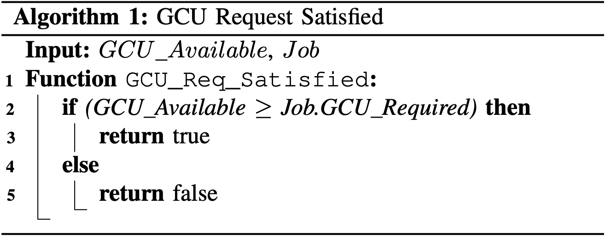</p>

<p align="center">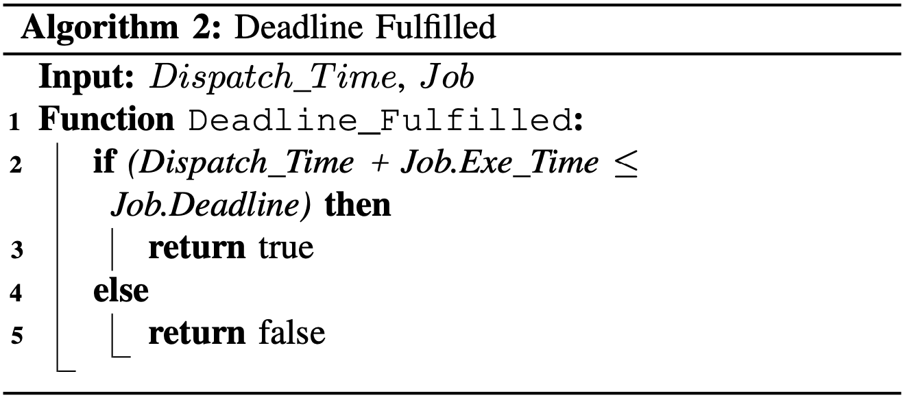</p>

<p align="center">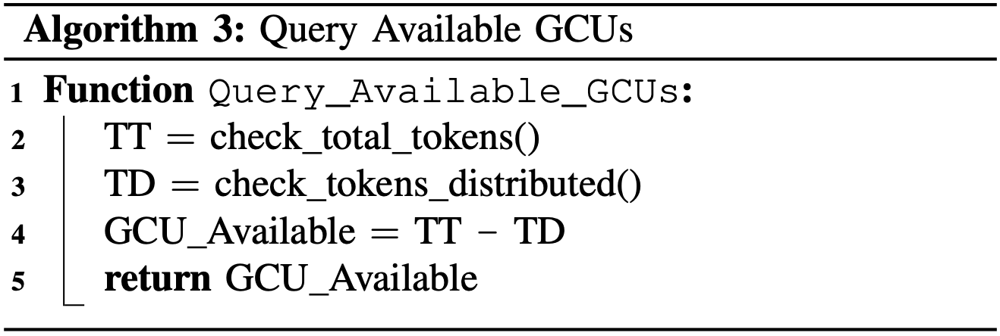</p>

<p align="center">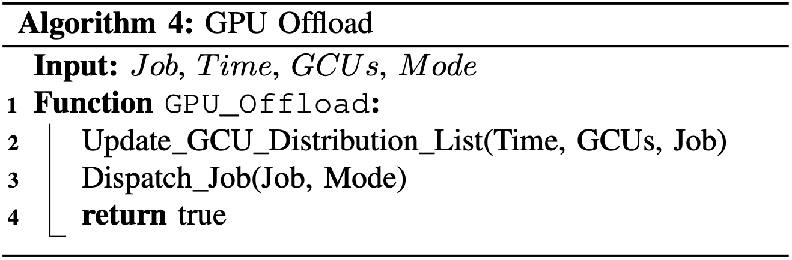</p>

<p align="center">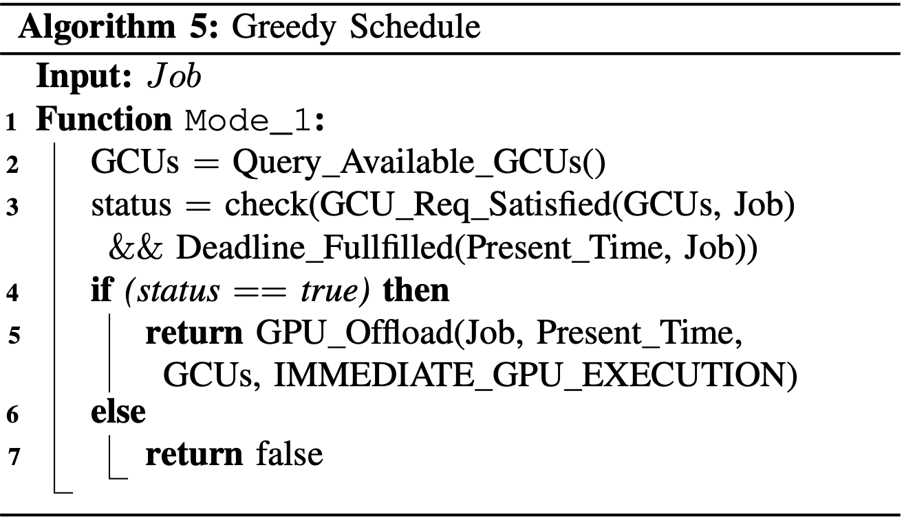</p>

### Mode 2 - Event Aware Schedule

<p align="center">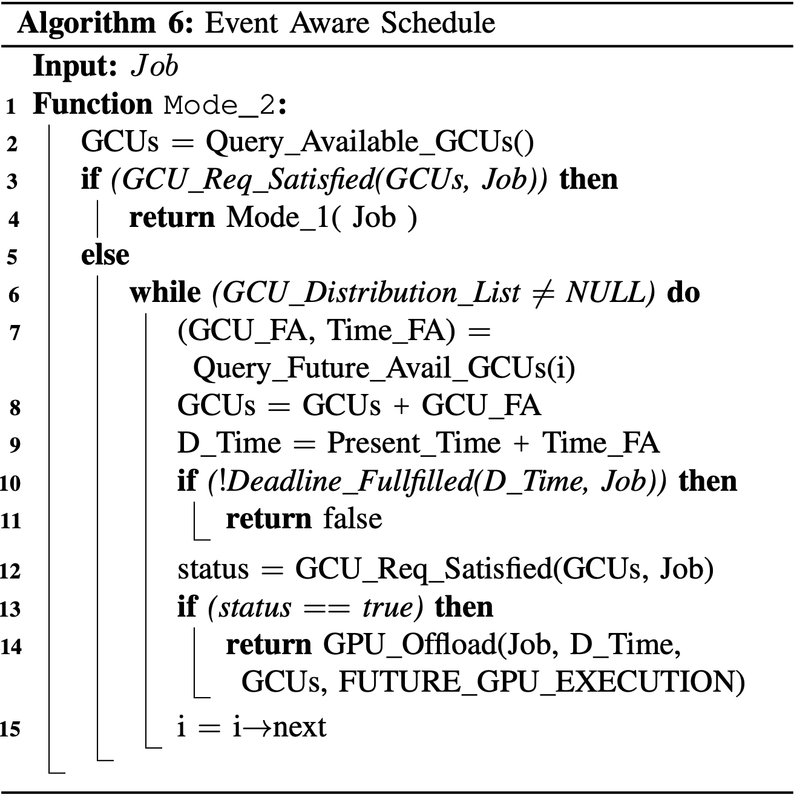</p>

### Mode 3 - Event Aware Schedule With Bias

<p align="center">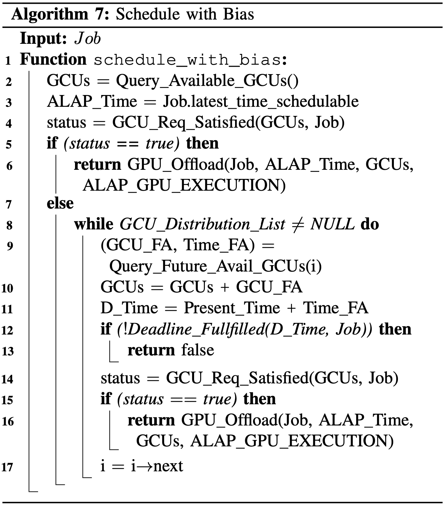</p>

<p align="center">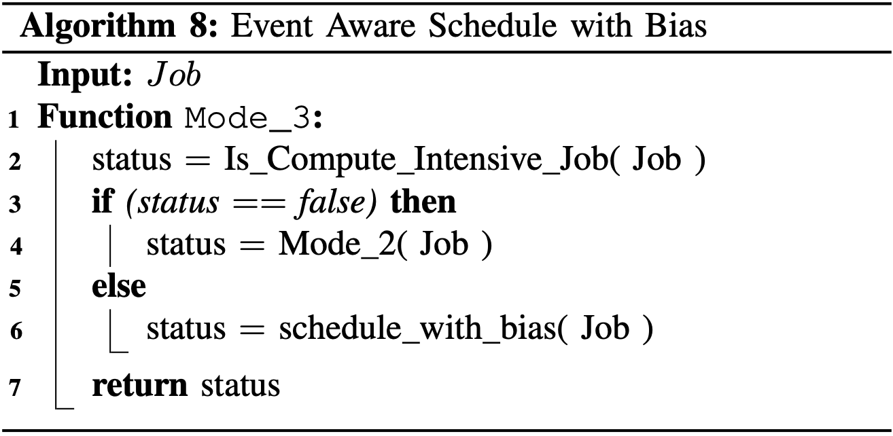</p>

### Mode 4 - Event Aware Schedule with Bias and Bias Prediction

<p align="center">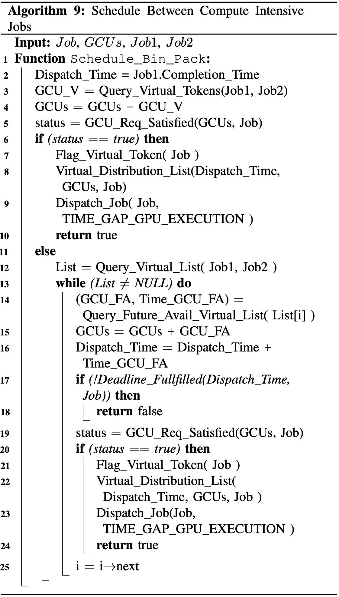</p>

<p align="center">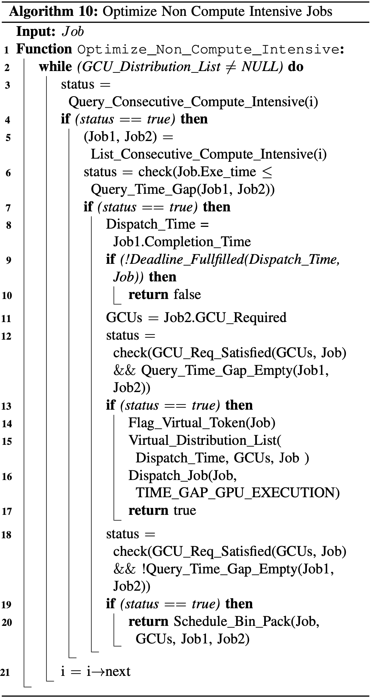</p>

<p align="center">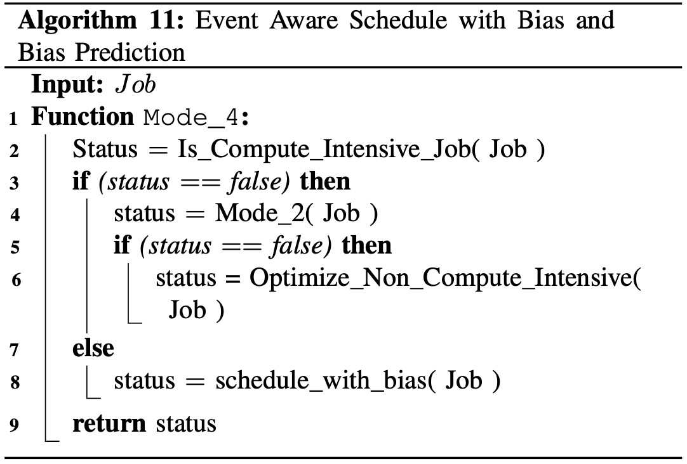</p>

### Mode 5 - Event Aware Schedule with Bias and Improved Bias Prediction

<p align="center">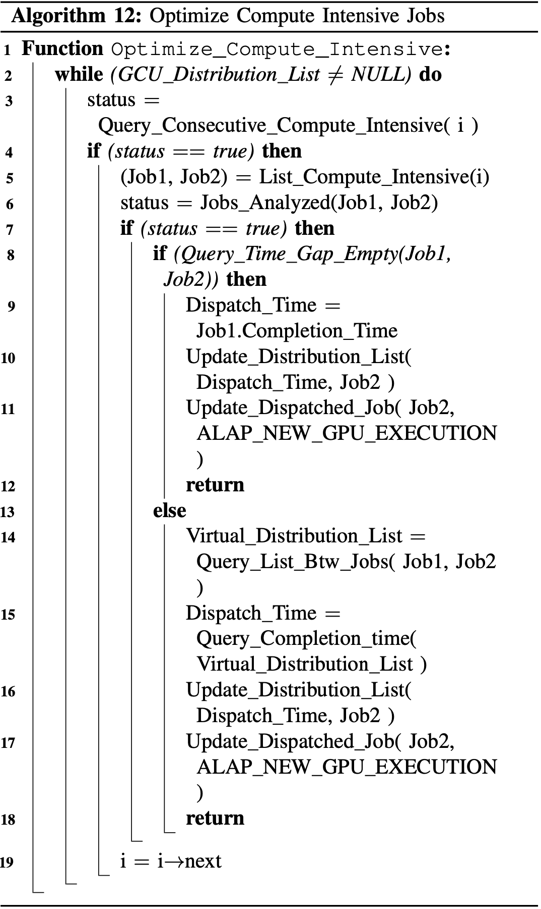</p>

<p align="center">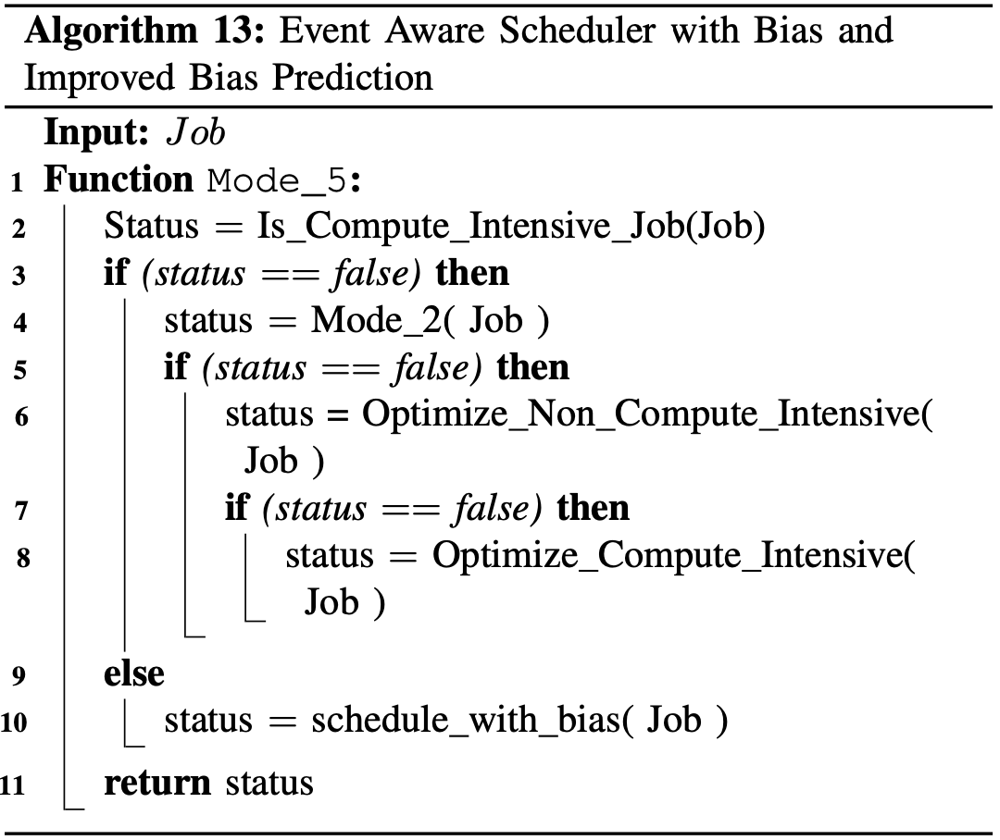</p>

## SRTG-JobCreator

We have developed a comprehensive job set creator tool, SRTG-JobCreator, that generates aperiodic soft-real-time job sets and associated data based on parameters such as job arrival rates, number of GCUs available, even/odd GCU requests and delay schedule GCU limit.

## SRTG-ResultAnalysis

Once the jobs are scheduled and the schedule data is obtained from SRTG-Scheduler, we use a result analysis tool, [SRTG-ResultAnalysis](SRTG-ResultAnalysis) to generate relevant data plots and provide insights into the results.

<p align="center">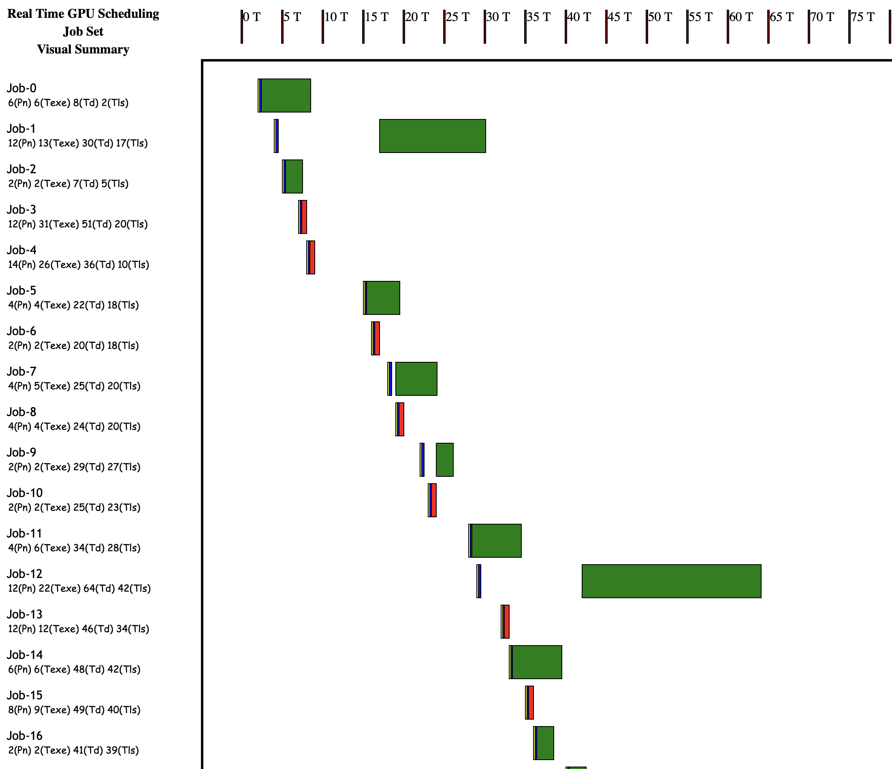</p>

<p align="center">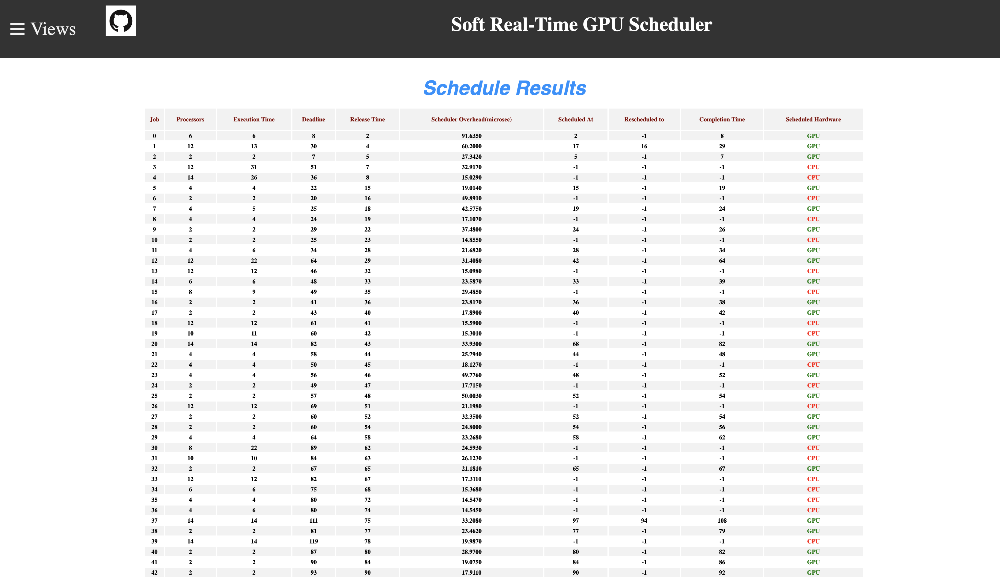</p>

<p align="center"></p>

## SRTG-Scheduler Usage

### Windows
```
SRTG-Scheduler [options] --j <jobs_file.csv>
                         --r <Release_Time_file.csv>
                         --m <option> 
                         --p <option> 
                         --d <option> 
                         --simulation <1/0>
                         --gpu <AMD/NVIDIA>
                         --method <0/1/2>
```
### Linux / macOS
```
./SRTG-Scheduler [options] --j <jobs_file.csv>
                           --r <Release_Time_file.csv>
                           --m <option> 
                           --p <option> 
                           --d <option>
                           --simulation <1/0>
                           --gpu <AMD/NVIDIA>
                           --method <0/1/2>
```

### Scheduler Options Supported
````
        --h/--help      -- Show full help
        --v/--verbose   -- Show detailed messages
````

### Scheduler Parameters
````
        --j/--jobs                 -- Jobs to be scheduled [required]
        --r/--releaseTimes         -- Release times for the jobs [required]
        --m/--mode                 -- Scheduler Mode [optional - default:5]
        --p/--maxProcessors        -- Max processors available on the GPU [optional - default:16]
        --d/--delayLimitPercentage -- Delay Schedule processor limit in percentage [optional - default:60]
        --s/--simulation 	   -- simulation mode turn ON/OFF [optional - default:ON]
        --g/--gpu 	           -- Jobs Scheduled on hardware <AMD/NVIDIA> - [optional - default:OFF]
        --method                   -- Scheduler Methods [optional - default:0]
````

#### Scheduler Policies -- The Modes Supported: <mode option>
```
        1 - Greedy Schedule
        2 - Event Aware Scheduler
        3 - Event Aware Scheduler with Bias
        4 - Event Aware Scheduler with Bias and Bias Prediction
        5 - Event Aware Scheduler with Bias and Improved Bias Prediction
```

#### Scheduler Methods -- The Methods Supported: <method option>
```
        0 - Base Scheduler Method
        1 - Enhanced Scheduler Method
        2 - Enhanced with varying quality of services Scheduler Method
```

#### A-periodic Jobs -- The Jobs File is the list of Jobs to be scheduled: <jobs_file.csv>
```
        Jid     - Job ID
        Pn      - Processors Needed
        Texe    - Execution Time
        Td      - Deadline
        Tlts    - Lastest Time Schedulable on the GPU
        Ph      - Processors Needed High
        Pm      - Processors Needed Medium
        Pl      - Processors Needed Low
        Th      - Execution Time High
        Tm      - Execution Time Medium
        Tl      - Execution Time Low
        DF      - Deadline Flexibilty

        "Jid, Pn, Texe, Td, Tlts, Ph, Pm, Pl, Th, Tm, Tl, DF"
```

#### A-periodic Job Release Times -- The Release Time File has the list of release times of the kernels: <Release_Time_file.csv>
```
        Tr      - Release Time
        Jr      - Number of jobs released

        "Tr, Jr"
```