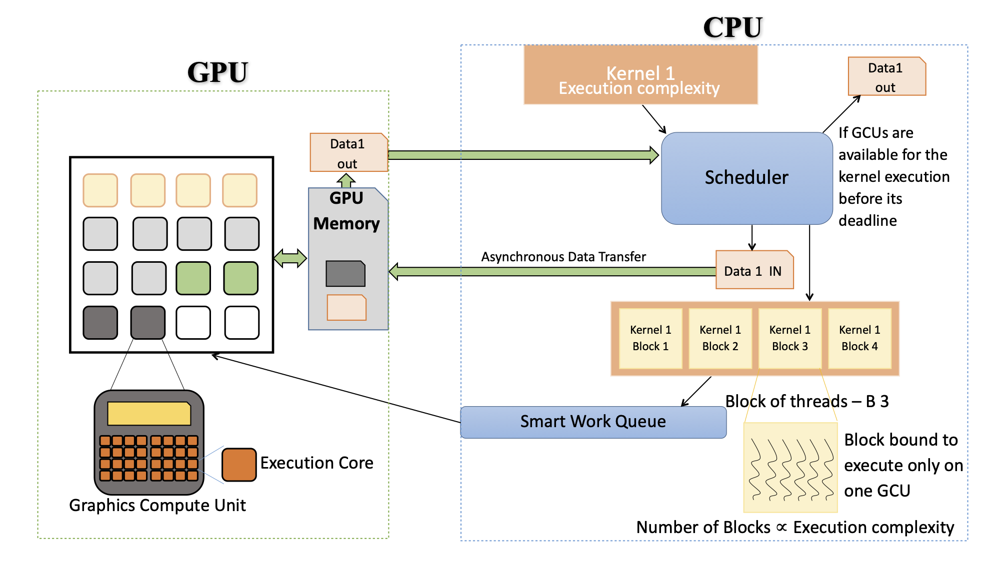

# Dynamic schedule management framework 

## A-periodic soft-real-time jobs on GPU based architectures

### Graphics Processing Units in Real-Time

Graphics Processing Units (GPUs) are computational powerhouses that were originally designed for accelerating graphics applications. However, in recent years, there has been a tremendous increase in support for general-purpose computing on GPUs (GPGPU). GPU based architectures provide unprecedented magnitudes of computation at a fraction of the power used by traditional CPU based architectures. As real-time systems integrate more and more functionality, GPU based architectures are very attractive for their deployment.

Based on where they are located and how they are used in a computing system, GPUs may be broadly classified into discrete GPUs (dGPUs), integrated GPUs (iGPUs), virtual GPUs (vGPU), and external GPUs (eGPUs). Personal computers generally use either discrete, also known as dedicated, GPUs (dGPUs) or integrated, also known as shared or unified memory architecture, GPUs (iGPUs).<a href="#note1" id="note1ref"><sup>[1]</sup></a>

### Real-Time Systems

However, in a real-time system, predictability and meeting temporal requirements are much more important than raw performance. While some realtime jobs may benefit from the performance that all cores of the GPU can provide, most jobs may require only a subset of cores to successfully meet their temporal requirements.  In this work, we implement concurrent scheduling of a-periodic soft-real-time jobs on a GPU based platform, while optimizing the memory usage on the GPGPU. We target dGPUs as they are widely used.

<p align="center"></p>

### Real-Time Jobs

In real-time jobs, the concept of a deadline is fundamental, i,e., a real-time compute workload must finish its execution and generate the results to the consumed by another real-time compute workload. These jobs are generally termed as hard or soft real-time jobs based on their deadline fulfillment requirement. This concept of the deadline is achievable because these jobs have a very reliable execution time. To achieve reliable execution time one needs to get accurate estimates of the worst-case execution time (WCET) of the job for specific hardware architectures. Another major differentiating characteristic of the hard or soft real-time job is the priority of jobs, which means that a job with a higher priority has the right to execute before the job with a lower priority. These characteristics of the real-time jobs must be meet to deploy them safely on a GPU based architecture.

### GPU Compatible Jobs

Jobs, also known as **kernels**, that are dispatched to the GPU for execution are usually jobs that involve performing the same set of operations on large volumes of data, i.e., jobs that map to a Single Instruction stream, Multiple Data stream (SIMD) model of parallelism. The GPU executes such jobs by launching many typically independent threads that perform a sequence of operations on a single data element. This feature allows GPUs to get unprecedented speed-ups when compared to other types of processors.

Not all jobs can be off-loaded on to the GPU, the jobs which are marked for GPU off-load needs to have very low or no divergence in the execution flow. This classification of job as GPU compatible or as GPU non-compatible needs to be done before we start the application. The jobs which are marked as GPU non-compatible will be scheduled exclusively on CPU. The GPU compatible jobs are sent to the GPU scheduler for evaluation, if the job is not off-loaded on to the GPU, the CPU scheduler will evaluate these jobs for scheduling.

### GPU Challenges

#### Worst-Case Execution Time

To the best of our knowledge, no technique produces safe estimates of the worst-case execution time or WCET of jobs for GPU based architectures.

#### Job Preemption

Features that allow GPUs to get unprecedented speed-ups also makes it challenging to safely preempt a job. When a job is preempted, its context needs to be stored so that the job can resume execution from the point at which it was preempted. However, on GPUs, there is no known method to safely storing the context of each executing thread. This makes preemption of a GPU job infeasible --- the job would essentially have to be restarted and intermediate results discarded. In early versions of GPU platforms, only one instruction stream or function represented by a kernel could execute on a GPU at any given time, regardless of GPU utilization.

#### CPU-GPU Data Transfers

The data transfers between the CPU and GPU happen over the PCI-e. 

### Motivation

Our motivation is to use the RTG-Scheduler in a system that has both CPU and GPU. This system could handle the large compute workload generated by a plethora of sensors used in today's real-time applications. By effectively off-loading as many jobs are possible on to the GPU, the scheduler can keep the CPU open for additional compute, while optimizing the GPU usage.

### Solution

#### Worst-Case Execution Time

The generation of accurate WCET for aperiodic soft real-time jobs on GPU using the conventional methods is not feasible. Hence, we experimented with the statistical analysis method to generate WCET for jobs on the GPU. The jobs are forced to execute on a fixed number of GCUs and the execution time is measured over many runs for each job. The standard deviation was used to quantify the amount of dispersion of run time data from all the runs for each job, we observed low standard deviation when the jobs are running on the fixed number of GCUs, indicating that the observed run times tend to be close to the mean.

To get a more accurate statistical  WCET we chose not to use the mean, but instead use a value which is two standard deviations from the mean value, because the jobs had a normal distribution with low standard deviation, choosing a number two standard deviations from the mean value would cover a very high percentage of the outliers giving us a more accurate bound on WCET. Given this premise, we can safely generate a statistical  WCET for a job with any fixed number of GCUs allocated to it. Hence, we can make sure that a job meets its deadline by allocating the job its appropriate share of GCUs to complete its execution.

#### Job Preemption

Once the GPU scheduler accepts a job, the job will not be preempted or sent back to the CPU scheduler, thus eliminating the concern about non-preemptivity.

#### CPU-GPU Data Transfers

The statistical analysis method to generate WCET for jobs on the GPU as includes the PCI-e data transfer times, hence addressing the data transfers.

### Our Approach

As we already established that there has been a tremendous increase in support for general-purpose computing on GPUs. More and more GPUs are being integrated into traditional CPU based architectural systems. As real-time systems integrate more and more functionality, GPU based architectures are very attractive for their deployment. But if the software support for the GPU off-load is limited or non-existent, a lot of computing is under-utilized. The GPU compute is also power-efficient, which makes it more attractive to offload as many jobs as possible on to the GPU and minimize the power utilization.

<p align="center"></p>

Our Scheduling framework resides on a CPU core and dispatches kernels to the GPU.

<p align="center"></p>

**note:**

* <a id="note1" href="#note1ref"><sup>[1]</sup></a>The disparity in the nomenclature of these GPUs is due to the fact that naming conventions of GPUs are dependent on their manufacturers.

## Aperiodic Soft-Real-Time Jobs On GPU Based Architectures

The SRTG-scheduler itself resides on the CPU. When a GPU compatible job is released, it is sent to the SRTG-scheduler, which checks if this job can be executed on the GPU before its deadline. If yes, the job is offloaded to the GPU and any data that it needs is transferred to GPU memory. Otherwise, the job is rejected and sent back to the CPU scheduler immediately.

The scheduler supports multiple policies for scheduling aperiodic soft-real-time jobs on the GPU, captured via five different modes.
* **Mode 1** - Greedy Schedule
* **Mode 2** - Event Aware Schedule
* **Mode 3** - Event Aware Schedule with Bias
* **Mode 4** - Event Aware Schedule with Bias and Bias Prediction
* **Mode 5** - Event Aware Schedule with Bias and Improved Bias Prediction

**Input:** **Aperiodic Soft-Real-Time** jobs compatible with GPU execution

### Mode 1 - Greedy Schedule

* Step 1: Check if the current available GCUs meet condition-1
* Step 2: If condition-1 is not met, reject job for GPU Execution. Else check for condition-2
* Step 3: If condition-2 is not met, reject job for GPU Execution. Else go to Step 4
* Step 4: Accept Job for GPU execution. Send the Job and Data required for execution for `IMMEDIATE` execution

#### **Algorithm 1:** GCU Request Satisfied
````
GCU_Request_Satisfied: GCU_Available, Job ::
    if( GCU_Available >= Job.GCU_Required):
        return true
    else
        return false
````

#### **Algorithm 2:** Deadline Fulfilled
```
Deadline_Fullfilled: Dispatch_Time, Job ::
    if( Dispatch_Time + Job.Execution_time <= Job.Deadline)
        return true
    else
        return false
```

#### **Algorithm 3:** Query Available GCUs
````
Query_Available_GCUs:
    TT = check_total_tokens()
    TD = check_tokens_distributed()
    GCU_Available = TT - TD
    return GCU_Available
````

#### **Algorithm 4:** Greedy Schedule
```
Mode_1: Job ::
    GCU_A = Query_Available_GCUs()
    status = check( GCU_Request_Satisfied( GCU_A, Job ) && Deadline_Fullfilled( present_time, Job ) )
    if( status == true )
        Update_GCU_Distribution_List( present_time, GCU_A, Job )
        Dispatch_Job( Job, IMMEDIATE_GPU_EXECUTION )
        return true
    else
        return false
```

### Mode 2 - Event Aware Schedule

* Step 1: Check if the current available GCUs meet condition-1
* Step 2: If condition-1 is not met with current available GUCs, check if condition-1 can be meet with the first future availability of GCUs.  
* Step 3: If condition-1 is met, check if condition-2 can be met when the current or future GCU availability. Else reject job for GPU Execution
* Step 4: If condition-1 & condition-2 are met, accept Job for GPU execution. Go to Step 5.
* Step 5: Send the Job and Data required for execution for `IMMEDIATE` execution or to the smart queue for `FUTURE` execution.

#### **Algorithm 5:** Event Aware Schedule
```
Mode_2: Job ::
    GCU_A = Query_Available_GCUs()
    if ( GCU_Request_Satisfied( GCU_A, Job ) )
    {
        Status = Mode_1( Job )
        return Status
    }
    else
    {
        while( GCU_Distribution_List != NULL )
        {
            ( Future_GCU_Available, Time_GCUs_Available ) = Query_Future_Available_GCU_Distribution_List( i )
            GCU_A = GCU_A + Future_GCU_Available
            Dispatch_Time = Present_Time + T_GCU_FA

            if ( !Deadline_Fullfilled( Dispatch_Time, Job ) )
                return false
                
            status = check( GCU_Request_Satisfied( GCU_A, Job ) )
            if( status == true )
                Update_GCU_Distribution_List( Dispatch_Time, GCU_A, Job )
                Dispatch_Job( Job, FUTURE_GPU_EXECUTION )
                return true
                
            i = i->next
        }
    }
```

### Mode 3 - Event Aware Schedule with Bias

* Step 1: Check if the job is compute-intensive or non-compute-intensive. If the job is non-compute-intensive go to Step 2, else go to Step 7.
* Step 2: Check if the current available GCUs meet condition-1
* Step 3: If condition-1 is not met with current available GUCs, check if condition-1 can be meet with the first future availability of GCUs.  
* Step 4: If condition-1 is met, check if condition-2 can be met when the current or future GCU availability. Else reject job for GPU Execution
* Step 5: If condition-1 & condition-2 are met, accept Job for GPU execution. Go to Step 6.
* Step 6: Send the Job and Data required for execution for `IMMEDIATE` execution or to the smart queue for `FUTURE` execution and return.
* Step 7: Check the latest time the job can be scheduled for GPU execution.
* Step 8: Check if condition-1 can be meet with the GCUs available at the latest schedulable time.
* Step 9: If condition-1 is not meet at the latest schedulable time, reject job for GPU Execution. Else go to Step 10.
* Step 10: Accept the job for GPU execution and send the job to the smart queue for `ALAP` execution and return.

#### **Algorithm 6:** Event Aware Schedule with Bias
```
Mode_3: Job ::
    Status = Query_Compute_Intensive_Job( Job )
    if( Status == False )
    {
        Status = Mode_2( Job )
        return Status
    }
    else
    {
        GCU_A = Query_Available_GCUs()
        ALAP_Dispatch_Time = Job.latest_time_schedulable
        status = check( GCU_Request_Satisfied( GCU_A, Job ) )
        if( status == true )
            Update_GCU_Distribution_List( ALAP_Dispatch_Time, GCU_A, Job )
            Dispatch_Job( Job, ALAP_GPU_EXECUTION )
            return true
        else
        {
            while( GCU_Distribution_List != NULL )
            {
                ( GCU_FA, T_GCU_FA ) = Query_Future_Available_GCU_Distribution_List( i )
                GCU_A = GCU_A + GCU_FA
                Dispatch_Time = Present_Time + T_GCU_FA

                if ( !Deadline_Fullfilled( Dispatch_Time, Job ) )
                    return false

                status = check( GCU_Request_Satisfied( GCU_A, Job ) )
                if( status == true )
                    Update_GCU_Distribution_List( ALAP_Dispatch_Time, GCU_A, Job )
                    Dispatch_Job( Job, ALAP_GPU_EXECUTION )
                    return true
                    
                i = i->next
            }
        }
    }
```

### Mode 4 - Event Aware Schedule with Bias and Bias Prediction

* Step 1: Check if the job is compute-intensive or non-compute-intensive. If the job is non-compute-intensive go to Step 2, else go to Step 8.
* Step 2: Check if the current available GCUs meet condition-1
* Step 3: If condition-1 is not met with current available GUCs, check if condition-1 can be meet with the first future availability of GCUs.
* Step 4: If condition-1 is not meet, try to tap GCUs in between two compute intensive jobs
* Step 5: If condition-1 is met, check if condition-2 can be met when the current or future GCU availability. Else reject job for GPU Execution
* Step 6: If condition-1 & condition-2 are met, accept Job for GPU execution. Go to * Step 6.
* Step 7: Send the Job and Data required for execution for `IMMEDIATE` execution or to the smart queue for `FUTURE` execution and return.
* Step 8: Check the latest time the job can be scheduled for GPU execution.
* Step 9: Check if condition-1 can be meet with the GCUs available at the latest schedulable time.
* Step 10: If condition-1 is not meet at the latest schedulable time, reject job for GPU Execution. Else go to Step 10.
* Step 11: Accept the job for GPU execution and send the job to the smart queue for `ALAP` execution and return.

#### **Algorithm 7:** Schedule In-Between Compute Intensive Jobs
```
Optimize_Non_Compute_Intensive_Job_Schedule: Job ::
    while( GCU_Distribution_List != NULL )
    {
        status = Check ( Query_List_For_Consecutive_Compute_Intensive_Jobs( i ) )
        if(status == true)
            (Job1, Job2) = List_Consecutive_Compute_Intensive_Jobs( i )
            status = check( Job.Exection_time <= Query_Time_Gap_Between_Compute_Intensive_Jobs(i) )
            if(status == true)
                Dispatch_Time = Job1.Completion_Time

                if( !Deadline_Fullfilled( Dispatch_Time, Job ) )
                    return false

                GCU_A = Job2.GCU_Required
                status = check( GCU_Request_Satisfied( GCU_A, Job ) && Query_Time_Gap_Empty() )
                if(status == true)
                    Flag_Job_With_Virtual_Token( Job )
                    Update_GCU_Virtual_Distribution_List( Dispatch_Time, GCU_A, Job )
                    Dispatch_Job( Job, ALAP_TIME_GAP_GPU_EXECUTION )
                    return true

                status = check( GCU_Request_Satisfied( GCU_A, Job ) && !Query_Time_Gap_Empty() )
                if(status == true)
                    GCU_V = Query_Virtual_Tokens_Inbtw_Jobs(Job1, Job2)
                    GCU_A = GCU_A - GCU_V
                    status = GCU_Request_Satisfied( GCU_A, Job )
                    if(status == true)
                        Flag_Job_With_Virtual_Token( Job )
                        Update_GCU_Virtual_Distribution_List( Dispatch_Time, GCU_A, Job )
                        Dispatch_Job( Job, ALAP_TIME_GAP_GPU_EXECUTION )
                        return true
                    else
                    {
                        Virtual_Distribution_List = Query_Virtual_List_Inbtw_Jobs( Job1, Job2 )
                        while( Virtual_Distribution_List != NULL )
                        {
                            ( GCU_FA, T_GCU_FA ) = Query_Future_Available_Virtual_Distribution_List( i )
                            GCU_A = GCU_A + GCU_FA
                            Dispatch_Time = Dispatch_Time + T_GCU_FA
                            if ( !Deadline_Fullfilled( Dispatch_Time, Job ) )
                                return false                
                            status = check( GCU_Request_Satisfied( GCU_A, Job ) )
                            if( status == true )
                                Flag_Job_With_Virtual_Token( Job )
                                Update_GCU_Virtual_Distribution_List( Dispatch_Time, GCU_A, Job )
                                Dispatch_Job( Job, ALAP_TIME_GAP_GPU_EXECUTION )
                                return true
                            i = i->next
                        }                       
                    }
        i = i->next
    }
```

#### **Algorithm 8:** Event Aware Schedule with Bias and Bias Predicition
```
Mode_4: Job ::
    Status = Query_Compute_Intensive_Job( Job )
    if( Status == False)
    {
        Status = Mode_2( Job )
        if( Status == false )
        {
            Status = Optimize_Non_Compute_Intensive_Job_Schedule( Job )
        }
        return Status
    }
    else
    {
        GCU_A = Query_Available_GCUs()
        ALAP_Dispatch_Time = Job.latest_time_schedulable
        status = check( GCU_Request_Satisfied( GCU_A, Job ) )
        if( status == true )
            Update_GCU_Distribution_List( ALAP_Dispatch_Time, GCU_A, Job )
            Dispatch_Job( Job, ALAP_GPU_EXECUTION )
            return true
        else
        {
            while( GCU_Distribution_List != NULL )
            {
                ( GCU_FA, T_GCU_FA ) = Query_Future_Available_GCU_Distribution_List( i )
                GCU_A = GCU_A + GCU_FA
                Dispatch_Time = Present_Time + T_GCU_FA
                if ( !Deadline_Fullfilled( Dispatch_Time, Job ) )
                    return false                
                status = check( GCU_Request_Satisfied( GCU_A, Job ) )
                if( status == true )
                    Update_GCU_Distribution_List( ALAP_Dispatch_Time, GCU_A, Job )
                    Dispatch_Job( Job, ALAP_GPU_EXECUTION )
                    return true                       
                i = i->next
            }
        }
    }
```

### Mode 5 - Event Aware Schedule with Bias and Advanced Bias Prediction

* Step 1: Check if the job is compute-intensive or non-compute-intensive. If the job is non-compute-intensive go to Step 2, else go to Step 8.
* Step 2: Check if the current available GCUs meet condition-1
* Step 3: If condition-1 is not met with current available GUCs, check if condition-1 can be meet with the first future availability of GCUs.
* Step 4: If condition-1 is not meet, try to tap GCUs in between two compute intensive jobs and allow for moving compute intensive job for early dispatch
* Step 5: If condition-1 is met, check if condition-2 can be met when the current or future GCU availability. Else reject job for GPU Execution
* Step 6: If condition-1 & condition-2 are met, accept Job for GPU execution. Go to Step 6.
* Step 7: Send the Job and Data required for execution for `IMMEDIATE` execution or to the smart queue for `FUTURE` execution and return.
* Step 8: Check the latest time the job can be scheduled for GPU execution.
* Step 9: Check if condition-1 can be meet with the GCUs available at the latest schedulable time.
* Step 10: If condition-1 is not meet at the latest schedulable time, reject job for GPU Execution. Else go to Step 10.
* Step 11: Accept the job for GPU execution and send the job to the smart queue for `ALAP` execution and return.

#### **Algorithm 9:** Reschedule Compute Intensive Jobs And Optimize
````
Optimize_Compute_Intensive_Job_Schedule:
    while( GCU_Distribution_List != NULL )
    {
        status = Check ( Query_List_For_Consecutive_Compute_Intensive_Jobs( i ) )
        if(status == true)
            (Job1, Job2) = List_Consecutive_Compute_Intensive_Jobs( i )
            status = Consecutive_Compute_Intensive_Jobs_Analyzed( Job1, Job2 )
            if(status == true)
                if(Query_Time_Gap_Empty(Job1, Job2))
                    Dispatch_Time = Job1.Completion_Time
                    Update_Distribution_List( Dispatch_Time, Job2 )
                    Update_Dispatched_Job( Job2, ALAP_GPU_EXECUTION )
                    return
                else
                    Virtual_Distribution_List = Query_Virtual_List_Inbtw_Jobs( Job1, Job2 )
                    Dispatch_Time = Query_Completion_time(Virtual_Distribution_List)
                    Update_Distribution_List( Dispatch_Time, Job2 )
                    Update_Dispatched_Job( Job2, ALAP_GPU_EXECUTION )
                    return
        i = i->next
    }
    return
````


#### **Algorithm 10:** Event Aware Schedule with Bias and Improved Bias Predicition
```
Mode_5: Job ::
    Status = Query_Compute_Intensive_Job( Job )
    if( Status == False)
    {
        Status = Mode_2( Job )
        if( Status == false )
        {
            Status = Optimize_Non_Compute_Intensive_Job_Schedule( Job )
            if( Status == false )
            {
                Optimize_Compute_Intensive_Job_Schedule()
            }
        }
        return Status
    }
    else
    {
        GCU_A = Query_Available_GCUs()
        ALAP_Dispatch_Time = Job.latest_time_schedulable
        status = check( GCU_Request_Satisfied( GCU_A, Job ) )
        if( status == true )
            Update_GCU_Distribution_List( ALAP_Dispatch_Time, GCU_A, Job )
            Dispatch_Job( Job, ALAP_GPU_EXECUTION )
            return true
        else
        {
            while( GCU_Distribution_List != NULL )
            {
                ( GCU_FA, T_GCU_FA ) = Query_Future_Available_GCU_Distribution_List( i )
                GCU_A = GCU_A + GCU_FA
                Dispatch_Time = Present_Time + T_GCU_FA

                if ( !Deadline_Fullfilled( Dispatch_Time, Job ) )
                    return false
                        
                status = check( GCU_Request_Satisfied( GCU_A, Job ) )
                if( status == true )
                    Update_GCU_Distribution_List( ALAP_Dispatch_Time, GCU_A, Job )
                    Dispatch_Job( Job, ALAP_GPU_EXECUTION )
                    return true
            
                i = i->next
            }
        }
    }
````
